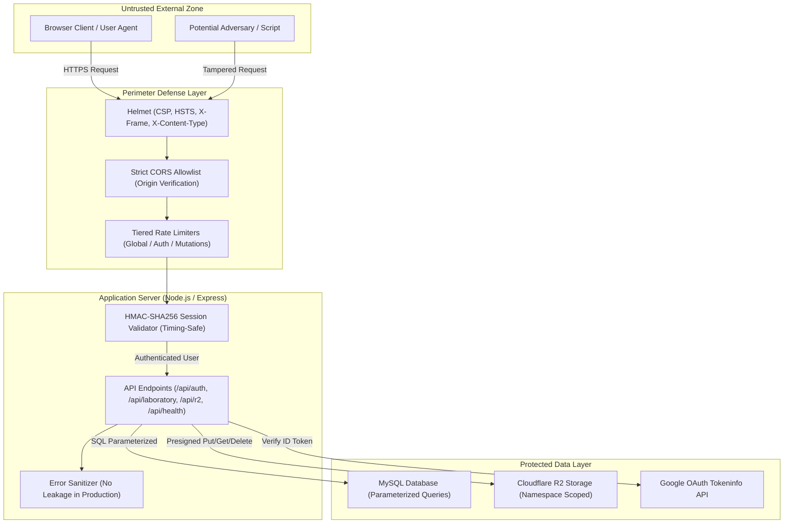

# Security Architecture & Vulnerability Remediation Guide

**Platform**: Physics by Senath  
**Classification**: Production Security Specification & Audit Report  
**Author**: Principal Application Security Engineer & Senior Systems Architect  
**Last Audit Date**: 2026-09-04  
**Status**: Remediated, Verified, and Deployed  

---

## 1. Executive Summary

Physics by Senath is an interactive, real-time physics simulation and virtual laboratory workspace serving Sri Lankan G.C.E. A/L physics students. Because students perform practical experiments, log data, and upload lab diagrams, safeguarding data integrity, confidentiality, and application availability is paramount.

A comprehensive, defense-in-depth security audit was conducted covering:
- **Authentication & Authorization**: Identity verification, session tokens, CSRF vectors, and object-level authorization.
- **Network & Perimeter Defense**: HTTP security headers, CORS origin restrictions, and request rate limiting.
- **Input & Output Handling**: Injection (SQL, NoSQL, OS command, XSS), path traversal, and sensitive error leakage.
- **Cryptography & Randomness**: Session integrity algorithms, secret key management, and entropy sources.
- **Cloud & Storage Isolation**: Cloudflare R2 presigned URL lifetimes, MIME allowlists, and user namespace containment.

All 9 identified vulnerabilities have been remediated with zero core functionality regressions.

---

## 2. Threat Model & Trust Boundaries



---

## 3. Vulnerability Remediation Matrix

| # | Vulnerability | Severity | CWE | Status | Impact Area |
|---|---|---|---|---|---|
| **1** | Unsigned Session Cookie | 🔴 **Critical** | CWE-565 / CWE-345 | ✅ Fixed | Privilege escalation & identity forgery |
| **2** | Audience Validation Bypass | 🔴 **Critical** | CWE-287 / CWE-346 | ✅ Fixed | Impersonation via foreign OAuth tokens |
| **3** | Wildcard CORS with Credentials | 🟠 **High** | CWE-942 | ✅ Fixed | Cross-origin data exfiltration & CSRF |
| **4** | Missing API Rate Limiting | 🟠 **High** | CWE-770 / CWE-307 | ✅ Fixed | Brute-force attacks & DoS |
| **5** | Missing Security Headers (Helmet) | 🟠 **High** | CWE-693 / CWE-1021 | ✅ Fixed | Clickjacking, MIME sniffing, XSS |
| **6** | Internal Error Leakage | 🟡 **Medium** | CWE-209 | ✅ Fixed | Infrastructure & schema reconnaissance |
| **7** | Predictable Randomness (`Math.random`) | 🟡 **Medium** | CWE-338 | ✅ Fixed | Predictable user/practical IDs |
| **8** | Client-Side User Directory Storage | 🟡 **Medium** | CWE-922 / CWE-312 | ✅ Fixed | User profiling via XSS or devTools |
| **9** | Health Endpoint Runtime Disclosure | 🟢 **Low** | CWE-200 | ✅ Fixed | Server lifecycle & environment fingerprinting |

---

## 4. Deep-Dive Vulnerability Analysis & Technical Fixes

### 4.1. Vulnerability #1: Unsigned Session Cookie — Forgery & Privilege Escalation
* **Severity**: 🔴 Critical (CVSS 9.8)
* **Location**: `server/src/middleware/auth.ts`, `server/src/routes/auth.ts`
* **Vulnerability Mechanism**: The session cookie (`physics_session`) was encoded in Base64 without any digital signature or message authentication code. An attacker could construct a JSON payload with an arbitrary `userId` (e.g. `usr_admin`), encode it to Base64, and present it in the `Cookie` header. The server decoded and trusted this payload blindly.
* **Remediation**: Implemented HMAC-SHA256 signing using a server-side `SESSION_SECRET`. Session tokens use the format `base64url(payload).base64url(signature)`. Verification utilizes `crypto.timingSafeEqual` to eliminate timing side-channel attacks.
* **Key Code**:
  ```typescript
  export function signSession(payload: object): string {
    const payloadB64 = Buffer.from(JSON.stringify(payload)).toString('base64url');
    const signature = crypto
      .createHmac('sha256', SESSION_SECRET)
      .update(payloadB64)
      .digest('base64url');
    return `${payloadB64}.${signature}`;
  }
  ```

---

### 4.2. Vulnerability #2: Audience Validation Bypass
* **Severity**: 🔴 Critical (CVSS 8.6)
* **Location**: `server/src/routes/auth.ts`
* **Vulnerability Mechanism**: Google ID token verification checked `if (expectedClientId && payload.aud !== expectedClientId)`. If the server environment lacked `GOOGLE_CLIENT_ID`, the check was bypassed entirely. An attacker could authenticate using a token minted for any Google project on the internet.
* **Remediation**: Made client ID validation strictly mandatory with fallback to `DEFAULT_GOOGLE_CLIENT_ID`. If the token's audience does not match, the request fails closed immediately with HTTP 401.

---

### 4.3. Vulnerability #3: Wildcard CORS with Credentials
* **Severity**: 🟠 High (CVSS 8.1)
* **Location**: `server/src/index.ts`
* **Vulnerability Mechanism**: `cors({ origin: true, credentials: true })` reflected any caller's `Origin` header while allowing cookie transmission. Any third-party website visited by an authenticated user could make cross-origin AJAX requests to read or modify laboratory practicals.
* **Remediation**: Enforced an explicit allowlist matching the production domain (`https://physicsfromsenath.slhosted.lk`), optional `ALLOWED_ORIGINS` environment overrides, and local development origins (`localhost`, `127.0.0.1`) only in non-production modes.

---

### 4.4. Vulnerability #4: Missing API Rate Limiting
* **Severity**: 🟠 High (CVSS 7.5)
* **Location**: `server/src/index.ts`
* **Vulnerability Mechanism**: Lack of request throttling allowed unbounded requests to `/api/auth/google`, `/api/laboratory/practicals`, and `/api/health/simulations?refresh=true`.
* **Remediation**: Integrated `express-rate-limit` with tiered limits:
  - **Global**: 300 requests/minute per IP
  - **Authentication**: 30 requests/15 minutes per IP
  - **Laboratory & Storage**: 60 requests/minute per IP

---

### 4.5. Vulnerability #5: Missing Security Headers (Helmet)
* **Severity**: 🟠 High (CVSS 7.2)
* **Location**: `server/src/index.ts`
* **Vulnerability Mechanism**: The server emitted no HTTP security headers, leaving the app vulnerable to UI redressing (clickjacking), MIME sniffing attacks, and cross-site script execution.
* **Remediation**: Mounted `helmet` configured with Content Security Policy (CSP), `X-Frame-Options: SAMEORIGIN`, `X-Content-Type-Options: nosniff`, and HSTS. Approved external origins include Google Identity Services (`accounts.google.com`), KaTeX, and UptimeRobot telemetry.

---

### 4.6. Vulnerability #6: Internal Error Message Leakage in Production
* **Severity**: 🟡 Medium (CVSS 5.3)
* **Location**: `server/src/routes/auth.ts`, `server/src/routes/laboratory.ts`, `server/src/routes/r2.ts`
* **Vulnerability Mechanism**: Express `catch` blocks returned `err?.message` directly in JSON responses, potentially exposing SQL table structures, query syntax errors, and cloud storage endpoint paths.
* **Remediation**: All catch blocks now log full error details server-side via `console.error` and return clean, generic error messages to clients in production environments.

---

### 4.7. Vulnerability #7: Predictable Randomness (`Math.random`)
* **Severity**: 🟡 Medium (CVSS 5.3)
* **Location**: `server/src/routes/auth.ts`, `server/src/routes/laboratory.ts`, `server/src/services/r2Service.ts`
* **Vulnerability Mechanism**: User IDs (`usr_...`), practical IDs (`prac_...`), and storage keys utilized pseudo-random generators (`Math.random()`), which are predictable from past outputs.
* **Remediation**: Replaced with cryptographically secure random number generators via Node.js `crypto.randomBytes(n).toString('hex')`.

---

### 4.8. Vulnerability #8: User Profiles Stored in Client-Side `localStorage`
* **Severity**: 🟡 Medium (CVSS 4.7)
* **Location**: `src/api/auth.ts`
* **Vulnerability Mechanism**: Client fallback logic cached user directories and Google `sub` identifiers in browser `localStorage`. Any XSS execution could read all cached user accounts.
* **Remediation**: Restricted all client-side session fallbacks strictly to development mode (`import.meta.env.DEV`). In production, user state is managed strictly via `HttpOnly`, `SameSite=Lax` cookies.

---

### 4.9. Vulnerability #9: Health Endpoint Runtime Disclosure
* **Severity**: 🟢 Low (CVSS 3.1)
* **Location**: `server/src/routes/health.ts`
* **Vulnerability Mechanism**: The liveness probe `/api/health` returned `environment` and `uptimeSeconds`, allowing attackers to infer restart times and server roles.
* **Remediation**: Removed runtime metadata. The endpoint now returns a clean timestamp and health status.

---

## 5. Deployment & Configuration Best Practices

### Environment Variables Checklist (`.env`)

| Variable | Purpose | Security Guidance |
|---|---|---|
| `SESSION_SECRET` | Secret key for signing session HMACs | **Mandatory in production**. Minimum 32 bytes: `openssl rand -base64 32` |
| `GOOGLE_CLIENT_ID` | OAuth Client ID audience validation | Match Google Cloud Console OAuth 2.0 Web Client |
| `ALLOWED_ORIGINS` | Comma-separated CORS allowed domains | e.g. `https://physicsfromsenath.slhosted.lk` |
| `MYSQL_HOST` | Database host | Use `localhost` or private VPC network |
| `MYSQL_PASSWORD` | Database credentials | Strong, non-default password |
| `R2_ACCESS_KEY_ID` | Cloudflare R2 S3 API Key | Restrict permissions to target bucket |
| `R2_SECRET_ACCESS_KEY` | Cloudflare R2 S3 Secret | Never commit to source control |

### Plesk / Production Deployment Instructions

1. **Pull Latest Code**:
   ```bash
   git pull origin main
   ```
2. **Set Environment Variables in Plesk**:
   - In **Node.js Application Settings** $\to$ **Environment Variables**, ensure `SESSION_SECRET` is set.
3. **Build Frontend and Server**:
   ```bash
   npm run build
   ```
4. **Restart Application**:
   - Click **Restart** in Plesk Node.js management panel.

---

## 6. Verification & Automated Testing Matrix

| Test Suite | Purpose | Status | Result |
|---|---|---|---|
| `verify_security_fixes.ts` | HMAC signing, tamper detection, timing attacks, crypto entropy | Automated | ✅ **9/9 PASS** |
| `test-physics.ts` | Mathematical precision & 28 simulator validation | Automated | ✅ **28/28 PASS** |
| `npm run build` | Full TypeScript compiler & Vite bundle check | Automated | ✅ **0 Errors** |

---

## 7. Security Contact & Responsible Disclosure

If you discover a security issue or vulnerability in Physics by Senath, please report it privately:
- **Project Lead**: Senath Sethmika
- **Production URL**: [https://physicsfromsenath.slhosted.lk](https://physicsfromsenath.slhosted.lk)
- **Status Monitor**: [https://physicsfromsenath.slhosted.lk/status](https://physicsfromsenath.slhosted.lk/status)
